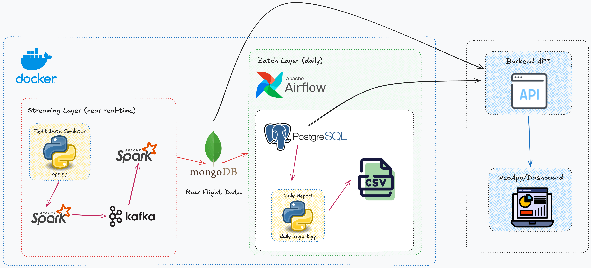

# Flight Data Pipeline + Dashboard

A full-stack data engineering project: real-time flight tracking streamed through Kafka and Spark, orchestrated by Airflow, stored in MongoDB and PostgreSQL, and visualized in a Next.js dashboard.




## Table of Contents
* [Tech Stack](#tech-stack)
* [Prerequisites](#prerequisites)
* [Setup](#setup)
  * [1. Clone and configure](#1-clone-and-configure)
  * [2. Install Python dependencies](#2-install-python-dependencies)
* [Running the full stack](#running-the-full-stack)
* [Service URLs](#service-urls)
* [API Reference](#api-reference)

## Tech Stack

| Layer | Technology |
|---|---|
| Message Queue | Apache Kafka + Zookeeper |
| Stream Processing | Apache Spark 3.5 Structured Streaming |
| Orchestration | Apache Airflow 2.6 |
| Raw Storage | MongoDB |
| Processed Storage | PostgreSQL 14 |
| Backend APIs | Python Flask |
| Frontend | Next.js + React + shadcn + Tailwind CSS |
| Infrastructure | Docker Compose |


## Prerequisites

- [Docker Desktop](https://www.docker.com/products/docker-desktop/) - allocate at least **8GB RAM**
- Python 3.9+
- Node.js 18+


## Setup

### 1. Clone and configure

```bash
git clone https://github.com/audreydng/flight-pipeline.git
cd flight-project/pipeline

cp .env.example .env
# Edit .env — change passwords before deploying anywhere public
```

### 2. Install Python dependencies (for local Flask apps)

```bash
pip install flask flask-cors pymongo psycopg2-binary requests
```

### 3. Install dashboard dependencies

```bash
cd ../dashboard
npm install
```


## Running the full stack

Start services in this order. Each step requires a separate terminal.

### Step 1 - Infrastructure (Docker)

```bash
cd pipeline/
docker compose up --build -d
```

Wait about 1 minute for all containers to be healthy:

```bash
docker compose ps
```

### Step 2 - Data source API

```bash
cd pipeline/
python app.py
# Simulated flight data at http://localhost:5001/api/flights
```

### Step 3 - Backend API

```bash
cd pipeline/
python backend_api.py
# Dashboard data API at http://localhost:5002
```

### Step 4 - Spark streaming (2 terminals)

```bash
# Terminal A - Producer: polls app.py every 5s, sends to Kafka
docker exec spark-master /opt/spark/bin/spark-submit \
  --conf spark.jars.ivy=/tmp/ivy \
  --packages org.apache.spark:spark-sql-kafka-0-10_2.12:3.5.5 \
  /opt/spark-apps/flight_producer.py
```

```bash
# Terminal B - Consumer: reads Kafka, writes to MongoDB every 10s
docker exec spark-master /opt/spark/bin/spark-submit \
  --conf spark.jars.ivy=/tmp/ivy \
  --packages org.apache.spark:spark-sql-kafka-0-10_2.12:3.5.5 \
  /opt/spark-apps/flight_consumer.py
```

> First run downloads about 100MB of Spark/Kafka JARs from Maven. Subsequent runs use cache.

### Step 5 - Dashboard

```bash
cd dashboard/
npm run dev
# http://localhost:3000
```

### Step 6 - Trigger Airflow DAG

Go to [http://localhost:8080](http://localhost:8080) to login with credentials from `.env`, then find `flights_dag` and trigger manually.

This populates PostgreSQL with landed flights and generates CSV reports in `pipeline/outputs/`.


## Service URLs

| Service | URL | Credentials |
|---|---|---|
| **Dashboard** | http://localhost:3000 | — |
| Airflow UI | http://localhost:8080 | from `.env` |
| Spark Master UI | http://localhost:9090 | — |
| pgAdmin | http://localhost:5050 | from `.env` |
| Flight Source API | http://localhost:5001/api/flights | — |
| Backend API | http://localhost:5002 | — |


## Dashboard Features

| Tab | Data Source | Shows |
|---|---|---|
| **Live Map** | MongoDB (via backend API) | Real-time aircraft positions, click to inspect flight details |
| **Flights** | PostgreSQL (via backend API) | Table of landed flights with delay status |
| **Reports** | PostgreSQL (via backend API) | Delay distribution chart, top airlines bar chart |

The dashboard auto-refreshes every **3 seconds**. The header shows live connection status for MongoDB and PostgreSQL.


## API Reference

### Flight Source API (`pipeline/app.py` - port 5001)

| Endpoint | Description |
|---|---|
| `GET /api/flights` | about 15 simulated flights, positions update every second |
| `GET /api/flights/<id>` | Single flight by ID |

### Backend API (`pipeline/backend_api.py` - port 5002)

| Endpoint | Source | Description |
|---|---|---|
| `GET /api/live-flights` | MongoDB | Active + recently landed flights |
| `GET /api/mongo-stats` | MongoDB | Collection statistics |
| `GET /api/pg-flights` | PostgreSQL | Last 100 processed flights |
| `GET /api/delay-distribution` | PostgreSQL | on_time / slightly_delayed / too_late counts |
| `GET /api/top-airlines` | PostgreSQL | Top 10 airlines by flight count |
| `GET /api/delay-ratio` | PostgreSQL | Airlines ranked by delay percentage |
| `GET /api/pipeline-status` | Both | Health check |


## Data Flow Details

**Delay classification** (`pipeline/plugins/insert_data_into_postgres.py`):

| Actual vs Scheduled | Status |
|---|---|
| < 15 min late | `on_time` |
| 15–30 min late | `slightly_delayed` |
| > 30 min late | `too_late` |

**Dashboard data flow**:
- Live Map updates every 3s → `GET /api/live-flights` → MongoDB
- Flights + Reports update every 3s → PostgreSQL endpoints
- PostgreSQL is populated by the Airflow DAG (runs daily, or trigger manually)


## Stop Pipeline

```bash
# Stop Spark jobs: Ctrl+C in their terminals
# Stop Flask apps: Ctrl+C in their terminals
# Stop dashboard: Ctrl+C
```

```bash
# Pause containers — preserves all data
docker compose stop

# Stop and remove containers — data still preserved (named volumes)
docker compose down

# Full reset — removes containers + ALL data
docker compose down -v
```

**Data persistence:**

| Command | MongoDB | PostgreSQL |
|---|---|---|
| `docker compose stop` | Preserved | Preserved |
| `docker compose down` | Preserved | Preserved |
| `docker compose down -v` | Deleted | Deleted |

> MongoDB and PostgreSQL use named Docker volumes (`mongo_data`, `postgres_data`). Data survives container restarts and `docker compose down`. Only `down -v` performs a full wipe.


## Notes

- `app.py` and `backend_api.py` run **outside Docker**, connect to containers via `localhost`
- Spark jobs run **inside Docker**, use Docker network hostnames (`broker:29092`, `mongodb:27017`)
- Dashboard connects to `backend_api.py` at `http://localhost:5002` by default — override with `NEXT_PUBLIC_API_BASE` in `dashboard/.env.local`
- Airflow DAG has `catchup=False` - will not backfill past dates on first run
- MongoDB stores all flight position snapshots (intentional duplicates for position history tracking)
